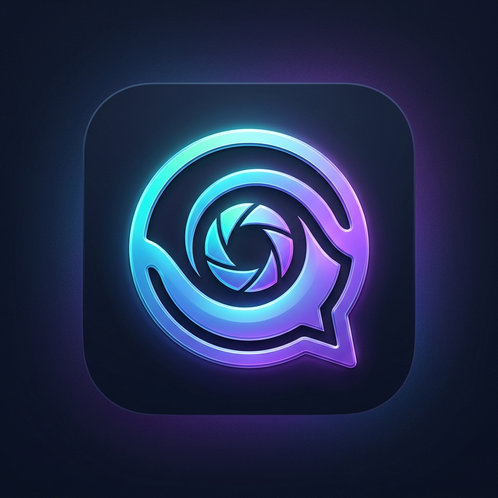
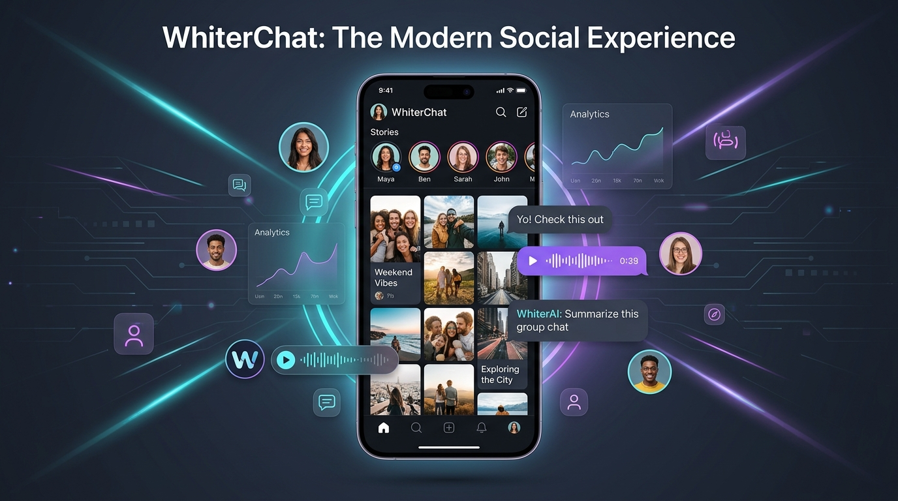
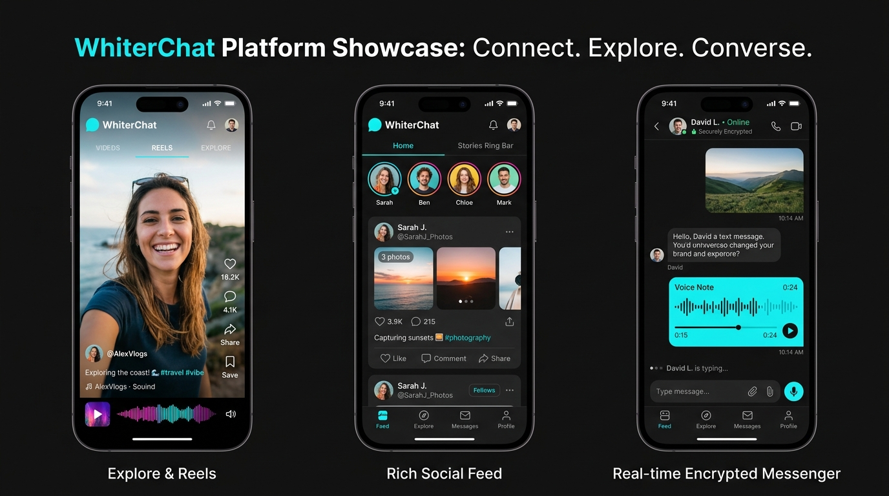

<div align="center">



# WhiterChat (وايتـر شات)
### The Next-Generation Social Media, Reels & Real-Time Messaging Platform
**منصة التواصل الاجتماعي المتكاملة: منشورات، ريلز، قصص تفاعلية، محادثات فورية مشفرة، مكالمات صوت وفيديو، واستوديو الذكاء الاصطناعي.**

[](https://www.typescriptlang.org/)
[](https://react.dev/)
[](https://nodejs.org/)
[](https://expressjs.com/)
[](https://www.mongodb.com/)
[](https://socket.io/)
[](https://tailwindcss.com/)
[](https://web.dev/progressive-web-apps/)

<br />

<p align="center">
  <a href="https://whiterchat.me"><strong>🌐 زيارة الموقع الرسمي (whiterchat.me) »</strong></a>
  <br />
  <a href="#-مميزات-المشروع-key-features">المميزات الرئيسية</a> •
  <a href="#-لقطات-شاشة-تفاعلية-screenshots">لقطات الشاشة</a> •
  <a href="#-البنية-التقنية-architecture">البنية المعمارية</a> •
  <a href="#-طريقة-التشغيل-quick-start">التشغيل السريع</a> •
  <a href="#-الأمان-وحماية-البيانات-security">الأمان والحماية</a>
</p>

---

</div>

<br />



<br />

## 🌟 نظرة عامة (Overview)

**WhiterChat** هو نظام تواصل اجتماعي حديث، قوي، وسريع جداً، تم تصميمه ليجمع أفضل ميزات كبرى المنصات العالمية (Instagram, WhatsApp, TikTok, Snapchat) في مكان واحد بتجربة مستخدم عربية وعالمية فائقة السلاسة والأناقة.

يقدم التطبيق دعماً كاملاً للهواتف الذكية عبر تطبيق **PWA (Progressive Web App)** يدعم العمل حتى دون اتصال بالإنترنت، ونظام إشعارات فورية متقدم، ومحادثات صوتية وكتابية في الزمن الحقيقي عبر **WebSockets** و **WebRTC**، بالإضافة إلى استوديو مدمج للذكاء الاصطناعي التوليدي ولوحة تحكم إدارية احترافية شاملة.

---

## 📸 لقطات شاشة تفاعلية (Screenshots & UI Showcase)

### 1. تجربة المستخدم، الريلز والرسائل الفورية (Social Experience & Messenger)
يعرض الشكل أدناه خلاصة المنشورات التفاعلية، شريط القصص (Stories)، قسم الريلز (Reels) بملء الشاشة، ونظام المحادثات الفورية المشفر مع مشغل الرسائل الصوتية.



### 2. لوحة الإدارة المتطورة والمكالمات الفورية (Admin Analytics & WebRTC Live Calls)
لوحة تحكم إدارية متكاملة لمراقبة المستخدمين، تحليل البيانات اللحظية، سجلات الأمان، والمكالمات الصوتية والمرئية بتقنية نظير إلى نظير (P2P WebRTC).


---

## ✨ المميزات الشاملة للمنصة (Key Features)

### 📱 1. المنشورات والوسائط التفاعلية (Rich Media Feed)
- **منشورات متعددة الصور والفيديو (Carousel & Video Posts):** دعم التمرير السلس، التكبير (Pinch-to-zoom)، والتشغيل التلقائي الذكي.
- **التفاعل الفوري:** إعجابات تفاعلية مع أنيميشن قلوب طافية، تعليقات متداخلة (Nested Replies)، ومشاركة المنشورات في الرسائل أو عبر روابط خارجية.
- **حفظ المنشورات والمجموعات (Bookmarks & Collections):** إمكانية تنظيم المنشورات المفضلة في مجلدات خاصة.
- **علامات الهاشتاغ والإشارات (Hashtags & Mentions):** اكتشاف الهاشتاغات الرائجة مع الإكمال التلقائي لأسماء المستخدمين `@username`.

### 🎥 2. ريلز وقصص يومية (Stories, Highlights & Viral Reels)
- **شريط القصص التفاعلي (Stories Rail):** عداد زمني 24 ساعة، فلاتر لونية، ملصقات تصويت واستفتاءات، وخيار الأصدقاء المقربين (**Close Friends**).
- **هايلايت الملف الشخصي (Story Highlights):** تثبيت القصص المميزة في بروفايل المستخدم مع أغلفة مخصصة.
- **مشغل ريلز عمودي (TikTok/Instagram-Style Reels):** تمرير عمودي فائق السرعة، دعم الموسيقى والصوتيات، وتفاعل فوري بدون أي تأخير.
- **سنابات سريعة التدمير (Disappearing Snaps):** ميزة الوسائط التي تختفي بعد المشاهدة لحماية الخصوصية.

### 💬 3. محادثات فورية ومكالمات مشفرة (Real-Time Messenger & Calls)
- **تراسل لحظي عبر Socket.io:** تحديث المحادثات دون الحاجة لإعادة تحميل الصفحة.
- **مؤشرات الكتابة والحالة (Typing & Online Presence):** معرفة المتصلين الآن وعداد الرسائل غير المقروءة.
- **رسائل صوتية تفاعلية (Audio Notes with Waveform):** تسجيل الصوت عبر الميكروفون مع رسم بياني موجي حي ومشغل سريع.
- **مكالمات صوت وفيديو (WebRTC Audio/Video Calls):** مكالمات مباشرة وآمنة بين المستخدمين مع شاشة اتصال عائمة، كتم الصوت، وتبديل الكاميرا.
- **إرسال الصور والفيديوهات والملفات:** تحميل ومشاركة فورية مع ضغط ذكي للأحجام.

### 🤖 4. استوديو الذكاء الاصطناعي (AI Studio & Smart Assistants)
- **مساعد ذكي للدردشة:** محادثة مدمجة مدعومة بالذكاء الاصطناعي لتقديم الاقتراحات والمساعدة.
- **توليد النصوص والردود الذكية (Smart Captions & AI Replies):** إنشاء كابشن احترافي للمنشورات واقتراح ردود ذكية على الرسائل.
- **تعديل وتحسين الصور:** فلاتر ذكية وتحسين ألوان الصور قبل النشر.

### 🛡️ 5. الأمان المتقدم والخصوصية (Enterprise Security & Trust)
- **المصادقة الثنائية (Two-Factor Authentication - 2FA):** دعم تطبيقات TOTP مثل Google Authenticator وأكواد النسخ الاحتياطي (Backup Codes).
- **الخزنة السرية المشفرة (Secure Vault):** حماية المحادثات أو الصور برمز PIN مستقل لا يمكن الوصول إليه إلا بعد تأكيد الهوية.
- **الحماية من الثغرات الأمنية:** تم فحص الكود وتأمينه ضد ثغرات (IDOR / BOLA, XSS, NoSQL Injection, CSRF, Rate Limiting).
- **تشفير كلمات المرور:** تشفير قوي باستخدام خوارزمية `bcrypt` مع Salt متعدد الدورات.
- **جلسات آمنة (JWT with Refresh Tokens):** إدارة توكنات تسجيل الدخول مع دعم تسجيل الخروج من كافة الأجهزة.

### 👥 6. التبديل بين الحسابات وتعدد الهويات (Multi-Account Switcher)
- دعم فتح عدة حسابات في نفس المتصفح أو التطبيق والتنقل بينها بضغطة زر واحدة دون الحاجة لإعادة كتابة كلمة المرور.

### 👑 7. لوحة تحكم الإدارة الفائقة (SuperAdmin & Moderation Hub)
- **إدارة المستخدمين:** تجميد، حظر، توثيق الشارة الزرقاء (Verified Badge)، وتغيير الرتب (Admin, Moderator, User).
- **مراقبة المحتوى والإبلاغات:** مراجعة البلاغات على المنشورات والتعليقات وحذف المحتوى المخالف فوراً.
- **إحصائيات النظام الحية:** رسوم بيانية لحجم الزوار، استهلاك السيرفر، معدل النمو اليومي، وأداء قاعدة البيانات.

### 📲 8. تطبيق ويب تقدمي متكامل (PWA & Offline Capability)
- **تثبيت مباشر على الهواتف والكمبيوتر:** يعمل كتطبيق أصلي (Native App) على أنظمة Android, iOS, Windows, macOS.
- **Service Worker ذكي:** تخزين الصفحات في الكاش للعمل السريع حتى في حال انقطاع الشبكة.
- **إشعارات Push Notification:** تنبيهات فورية بالرسائل والإعجابات والتعليقات.

---

## 🏗️ البنية المعمارية للنظام (Architecture & Tech Stack)

```text
                               ┌────────────────────────┐
                               │     WhiterChat DNS     │
                               │   (whiterchat.me)      │
                               └───────────┬────────────┘
                                           │
                                           ▼
                               ┌────────────────────────┐
                               │   Cloudflare Tunnel    │
                               │     & Edge Network     │
                               └───────────┬────────────┘
                                           │
                ┌──────────────────────────┴──────────────────────────┐
                │                                                     │
                ▼                                                     ▼
     ┌──────────────────────┐                              ┌──────────────────────┐
     │   React Frontend     │                              │  Express API Server  │
     │  (Vite + Tailwind)   │ <────── WebSockets ────────> │ (Node.js + Socket.io)│
     │  PWA / ServiceWorker │         & REST APIs          │  Rate Limiting, Auth │
     └──────────────────────┘                              └──────────┬───────────┘
                                                                      │
                                                           ┌──────────┴───────────┐
                                                           │   MongoDB Database   │
                                                           │ (Mongoose Schemas)   │
                                                           └──────────────────────┘
```

### التقنيات المستخدمة:
- **الواجهة الأمامية (Frontend):** React 19, TypeScript, Vite, Tailwind CSS, Framer Motion, Lucide Icons, Radix UI, TanStack Query.
- **الخادم الخلفي (Backend API):** Node.js, Express, Socket.io, Pino Logger, Web-Push, JSONWebToken, Bcrypt.
- **قاعدة البيانات (Database):** MongoDB عبر مكتبة Mongoose مع فهارس أداء واستعلامات محسّنة.
- **الاتصال المباشر (Real-Time):** Socket.io للتراسل اللحظي + WebRTC P2P للمكالمات الصوتية والمرئية.
- **التخزين والأمان (Media & Cloud):** Cloudinary / Local Blob Storage للوسائط، Rate-limit للحماية من هجمات DDoS وBrute-force.

---

## 🚀 طريقة التثبيت والتشغيل المحلي (Quick Start)

### المتطلبات الأساسية:
- **Node.js** (الإصدار 18 أو أحدث)
- **pnpm** أو **npm** أو **bun**
- **MongoDB Server** (محلي أو MongoDB Atlas)

### خطوات التشغيل:

1. **استنساخ المستودع (Clone the Repository):**
   ```bash
   git clone https://github.com/shahedalmefleh850/WhiterChat.git
   cd WhiterChat
   ```

2. **تثبيت الحزم البرمجية (Install Dependencies):**
   ```bash
   npm install
   ```

3. **إعداد متغيرات البيئة (Environment Variables):**
   قم بنسخ ملف الإعدادات وإنشاء ملف `.env`:
   ```bash
   cp .env.example .env
   ```
   املأ القيم المطلوبة في ملف `.env`:
   ```env
   PORT=3000
   NODE_ENV=development
   MONGODB_URI=mongodb+srv://<username>:<password>@cluster.mongodb.net/whiterchat
   JWT_SECRET=your_super_strong_jwt_secret_key_here
   JWT_REFRESH_SECRET=your_super_strong_refresh_secret_key_here
   FRONTEND_ORIGINS=https://whiterchat.me,http://localhost:3000
   ```

4. **تشغيل المشروع في وضع التطوير (Run Development Server):**
   ```bash
   npm run dev
   ```
   افتح المتصفح وتوجه إلى الرابط: `http://localhost:3000`

5. **بناء النسخة الإنتاجية (Production Build):**
   ```bash
   npm run build
   npm start
   ```

---

## 🔒 الأمان وحماية الخصوصية (Security Standards)

- ✅ **سياسات الخصوصية وشروط الاستخدام:** صفحات قانونية متكاملة تتوافق مع معايير GDPR وCCPA.
- ✅ **حماية ضد التلاعب بالحسابات (RBAC):** نظام صلاحيات هرمي صارم (`user`, `moderator`, `admin`, `superadmin`).
- ✅ **حظر التتبع العشوائي:** حجب كلمات المرور وتوكنات التحقق من كافة استعلامات قواعد البيانات التلقائية (`select: false`).
- ✅ **إيقاف هجمات التخمين:** حماية مسارات تسجيل الدخول بـ Rate Limiter متطور يمنع المحاولات المتكررة.

---

## 📄 الترخيص (License)
هذا المشروع مرخص بموجب ترخيص **MIT** - يمكنك استخدامه، تعديله، وتطويره بحرية.

---

<div align="center">
  <sub>تم التطوير بكل فخر بواسطة فريق <strong>WhiterChat Platforms</strong> © 2026. جميع الحقوق محفوظة.</sub>
</div>
